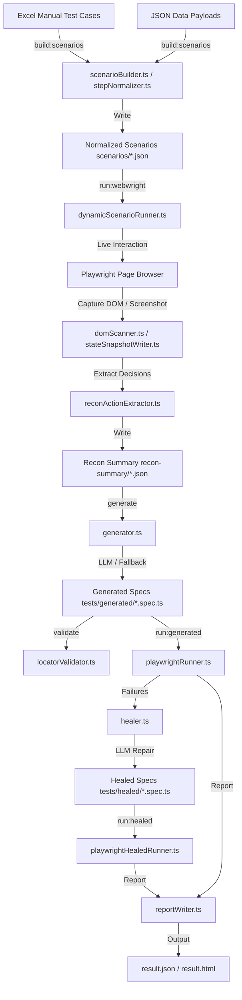

# Playwright AI Automation Framework Technical Document

The Playwright AI Automation Framework is an enterprise-grade, high-performance web application testing engine. It programmatically bridges natural language manual testing flows with deterministic execution and LLM-driven self-healing static test specifications.

The framework supports two core execution modes:
1. **Dynamic Execution (Webwright)**: Runs natural language scenarios directly against a live system by dynamically scanning the DOM and choosing appropriate locator actions at run-time.
2. **Static Spec Generation & Healing**: Generates robust, executable Page Object Model (POM)-based Playwright TypeScript specifications, validates their locators statically, runs them, and automatically heals runtime execution failures using LLM-driven repairs.

---

## 1. Current Features & Core Innovations

The framework combines dynamic web scraping with deterministic fallback strategies and LLM reasoning. The following core innovations drive its capabilities:

### ⚡ Smart Scenario Normalization & Row Menus
*   **The Problem:** Manual test cases written in spreadsheets often contain compound steps (e.g. "enter details and click save"), generic row instructions (e.g. "click Actions for the user"), or require complex navigation that causes direct execution engines to crash.
*   **The Solution:** The step normalizer ([stepNormalizer.ts](file:///Users/pi-in-173/Desktop/MCP_codebase/playwrigth-framework/src/scenario/stepNormalizer.ts)) decomposes complex instruction phrases into atomic steps. 
*   **Row-Specific Menu Disambiguation:** When encountering generic actions on row objects (e.g., clicking edit or deactivate for a specific user), the normalizer uses [payloadIdentityResolver.ts](file:///Users/pi-in-173/Desktop/MCP_codebase/playwrigth-framework/src/scenario/payloadIdentityResolver.ts) to find a unique identifier in the JSON payload (like an email or username). It splits the instruction into:
    1.  `Click Actions Menu for [Identity Value]`
    2.  `Click [Action Name]`
    This allows the runner to target specific table records safely.

### 🛡️ Hybrid Deterministic-First Locator Engine
*   **The Problem:** Standard LLM web agents are slow, expensive, and frequently target unstable or broad CSS/XPath classes that break upon minor frontend changes.
*   **The Solution:** The decision engine ([actionDecisionEngine.ts](file:///Users/pi-in-173/Desktop/MCP_codebase/playwrigth-framework/src/recon/actionDecisionEngine.ts)) prioritizes deterministic locators over LLM guesses. 
*   **Locator Priority:** [deterministicLocatorResolver.ts](file:///Users/pi-in-173/Desktop/MCP_codebase/playwrigth-framework/src/recon/deterministicLocatorResolver.ts) builds element candidate priorities using a predefined hierarchy:
    $$\text{Priority: } \text{getByTestId} > \text{getByRole} > \text{getByLabel} > \text{getByPlaceholder} > \text{getByText} > \text{css} > \text{xpath}$$
*   **Locator Safety Policies:** Unsafe selectors (broad tags like `button`, duplicate locators, positional index reliance, or XPath strings) are validated and blocked by [locatorSafetyValidator.ts](file:///Users/pi-in-173/Desktop/MCP_codebase/playwrigth-framework/src/recon/locatorSafetyValidator.ts) unless specifically enabled in the policy configuration.

### 🔄 Stateful Dynamic Payloads & Faker Factory
*   **The Problem:** E2E test flows frequently fail due to database unique constraint violations (e.g., trying to register the same email address twice) or require passing dynamically generated values from one test case to a subsequent test case.
*   **The Solution:** A Zod-validated Faker Factory ([fakerFactory.ts](file:///Users/pi-in-173/Desktop/MCP_codebase/playwrigth-framework/tests/data/fakerFactory.ts)) parses keys and dynamically replaces values on every run:
    *   **Dynamic Data Generation:** Standard keys (e.g., FirstName, LastName, Email, Contact) are matched via regex heuristics in [fieldDetector.ts](file:///Users/pi-in-173/Desktop/MCP_codebase/playwrigth-framework/tests/data/fieldDetector.ts) and filled with fresh dynamic mock data.
    *   **Explicit Faker Override:** Fields mapped to `[FAKER:stateKey]` generate a random string and cache it.
    *   **Explicit State Hand-off:** Fields containing `[SHARED:stateKey]` retrieve the value cached in [sharedStateManager.ts](file:///Users/pi-in-173/Desktop/MCP_codebase/playwrigth-framework/tests/data/sharedStateManager.ts) from previous test scenario runs.
    *   **Negative Pass Protection:** Test steps marked with `negative` or `invalid` data strategies bypass Faker generation to preserve intentionally bad inputs, while still resolving shared cross-scenario values.

### 🔍 AST-Based Static Code Audit
*   **The Problem:** Automated code generators often output tests with duplicate queries, missing assertions, hardcoded secrets, or flaky timeouts.
*   **The Solution:** The framework runs a static analysis sweep ([locatorValidator.ts](file:///Users/pi-in-173/Desktop/MCP_codebase/playwrigth-framework/src/recon/locatorValidator.ts)) using the TypeScript AST parser (`typescript` API) on generated specs.
*   **Audit Rules Checked:**
    *   `missing-expect`: Alerts if a test contains no assertions.
    *   `hardcoded-login-password` / `hardcoded-credential-fill`: Blocks hardcoded secrets, verifying the script refers to `process.env.LOGIN_PASSWORD`.
    *   `networkidle-before-alert`: Warns if `waitForLoadState('networkidle')` is invoked in close proximity to checking an alert/toast, since temporary alert panels frequently auto-dismiss during long wait times.
    *   `generic-get-by-text`: Flagged when text locators use short/common words (e.g. "Save", "Add").
    *   `xpath-fallback` / `broad-css-locator`: Flags fragile raw tag/path queries.

### 🩹 Auto-Adaptive LLM Healing
*   **The Problem:** Spec generation can fail at runtime due to visual latency, element occlusion, or minor DOM layout mismatches.
*   **The Solution:** The healer ([healer.ts](file:///Users/pi-in-173/Desktop/MCP_codebase/playwrigth-framework/src/llm/healer.ts)) automatically parses stderr trace files, identifies failed lines, reads the associated dynamic recon DOM snapshots, and prompts the LLM to patch locators and wait cycles.
*   **Relative Path Correction:** The healing engine automatically corrects relative imports. Because healed tests are outputted to `tests/healed/` (two folders down), the healer forces imports to use `../../pages/...` or `../../playwright.config` to prevent compilation failures.

---

## 2. Technical Architecture & Technology Stack

The framework separates scenario building, browser execution, code generation, code verification, and code repair to keep token usage low and steps deterministic.



### Technology Stack
*   **Language & Runtime:** TypeScript compiled and run with `ts-node`.
*   **Browser Automation:** Playwright (`@playwright/test`).
*   **LLM Providers:** Unified client adapter ([llmClient.ts](file:///Users/pi-in-173/Desktop/MCP_codebase/playwrigth-framework/src/llm/llmClient.ts)) supporting:
    *   **OpenAI:** (via `openai` SDK, defaults to `gpt-4.1-mini`).
    *   **Google Gemini:** (via `@google/generative-ai` SDK, defaults to `gemini-2.5-flash`).
*   **Parser & AST Scanner:** TypeScript Compiler API (`typescript`).
*   **Data Generation:** `@faker-js/faker` for dynamic profiles.
*   **Inputs Parsing:** `xlsx` for Excel sheets, `yaml` for framework options.
*   **State Caching:** Local JSON database ([sharedState.json](file:///Users/pi-in-173/Desktop/MCP_codebase/playwrigth-framework/tests/data/sharedState.json)) monitored via [sharedStateManager.ts](file:///Users/pi-in-173/Desktop/MCP_codebase/playwrigth-framework/tests/data/sharedStateManager.ts).

---

## 3. Server Configuration & CLI Catalog

Framework configurations are defined in [config.yaml](file:///Users/pi-in-173/Desktop/MCP_codebase/playwrigth-framework/config.yaml):
```yaml
locator:
  testIdAttributes:
    - data-testid
    - data-test
    - data-cy
    - data-qa
  autoDetectDataAttributes: false
execution:
  generationConcurrency: 5
```

### NPM CLI Scripts
The following commands drive the framework lifecycle:

| Command | Script Entry | Description |
| :--- | :--- | :--- |
| `npm run build:scenarios` | [scenarioBuilder.ts](file:///Users/pi-in-173/Desktop/MCP_codebase/playwrigth-framework/src/scenario/scenarioBuilder.ts) | Parses Excel test flows and JSON payloads into normalized scenarios. |
| `npm run run:webwright` | [dynamicScenarioRunner.ts](file:///Users/pi-in-173/Desktop/MCP_codebase/playwrigth-framework/src/runner/dynamicScenarioRunner.ts) | Executes dynamic browser steps using DOM state recon. |
| `npm run generate` | [generator.ts](file:///Users/pi-in-173/Desktop/MCP_codebase/playwrigth-framework/src/llm/generator.ts) | Translates recon actions into Playwright TypeScript `.spec.ts` files. |
| `npm run validate` | [locatorValidator.ts](file:///Users/pi-in-173/Desktop/MCP_codebase/playwrigth-framework/src/recon/locatorValidator.ts) | Inspects generated spec locators for accessibility, duplicates, and secrets. |
| `npm run run:generated` | [playwrightRunner.ts](file:///Users/pi-in-173/Desktop/MCP_codebase/playwrigth-framework/src/runner/playwrightRunner.ts) | Runs the generated test suite under `tests/generated/`. |
| `npm run heal` | [healer.ts](file:///Users/pi-in-173/Desktop/MCP_codebase/playwrigth-framework/src/llm/healer.ts) | Repairs failed spec lines based on run errors and snapshots. |
| `npm run run:healed` | [playwrightHealedRunner.ts](file:///Users/pi-in-173/Desktop/MCP_codebase/playwrigth-framework/src/runner/playwrightHealedRunner.ts) | Executes repaired tests under `tests/healed/`. |
| `npm run report` | [reportWriter.ts](file:///Users/pi-in-173/Desktop/MCP_codebase/playwrigth-framework/src/reports/reportWriter.ts) | Combines validation, generation, execution, and healing results. |
| `npm run pipeline` | *Compound Script* | Orchestrates the entire lifecycle end-to-end. |
| `npm run mcp` | [server.ts](file:///Users/pi-in-173/Desktop/MCP_codebase/playwrigth-framework/src/mcp/server.ts) | Spins up the Stdio-based Model Context Protocol (MCP) server. |

### Model Context Protocol (MCP) Tools
When running as an MCP server (`npm run mcp`), the application exposes the following tools to clients:
*   `run_pipeline`: Executes the end-to-end testing pipeline. Dynamically redirects file inputs and outputs when provided with custom paths.
*   `list_scenarios`: Scans the scenario directory and lists parsed cases.
*   `get_latest_report`: Fetches the final consolidated execution JSON report.
*   `get_pipeline_log`: Returns the STDOUT/STDERR logs of the last pipeline run.

---

## 4. Open Gaps & Technical Backlog

> [warning]
> The following developmental gaps require engineering focus in future iterations:

1.  **Sequential Dynamic Execution Bottleneck:** The dynamic scenario runner runs browser steps sequentially inside a loop. Under large input volumes (e.g. 50+ Excel cases), this results in long execution times.
2.  **Shared State Write Collisions:** The shared state engine ([sharedStateManager.ts](file:///Users/pi-in-173/Desktop/MCP_codebase/playwrigth-framework/tests/data/sharedStateManager.ts)) reads and writes to a single JSON file without concurrency lock protections. If two parallel test suites write to this file simultaneously, data corruption or missing keys may occur.
3.  **Basic DOM Virtualization Failures:** Offscreen table rows or dropdown listings that are virtualized out of the DOM are missing in static snapshots. The deterministic engine cannot locate virtualized elements without scroll actions.
4.  **OpenAPI Spec Generation Gap:** The data parser handles structured Excel/JSON payloads but does not ingest Swagger/OpenAPI files to auto-derive API payload structures.

---

## 5. Limitations

> [caution]
> The following operational limitations affect framework execution:

*   **Dynamic Visual Elements Drop:** The DOM scanner extracts text, labels, roles, and boundaries. It cannot interpret visual graphics within Canvas, WebGL, or SVG diagrams.
*   **Shadow DOM Inaccessibility:** Standard DOM scanners bypass elements hidden inside closed Shadow Roots, preventing locators from matching custom shadow component elements.
*   **Flaky Network Idle Timeouts:** Reliance on `waitForLoadState('networkidle')` can cause tests to stall on pages with long-lived WebSocket connections, polling endpoints, or tracking scripts.
*   **Strict Healing Import Structure:** The repair healer expects a standard directory depth of two folders (`tests/healed/`). Moving generated scripts to deeper subdirectories will break rewritten relative imports.

---

## 6. Developmental Roadmap

*   **Parallel Dynamic Execution:** Introduce parallel page context queues to run dynamic step executions concurrently.
*   **Visual Regression Assertions:** Capture screenshots during dynamic runs and assert visual consistency in generated specs.
*   **Shadow DOM Scanner Injection:** Inject custom scripting into the browser context to parse closed shadow nodes.
*   **FastAPI Backend Transition:** Transition from fastmcp stdio wrappers to a robust FastAPI REST service to support distributed runners.
